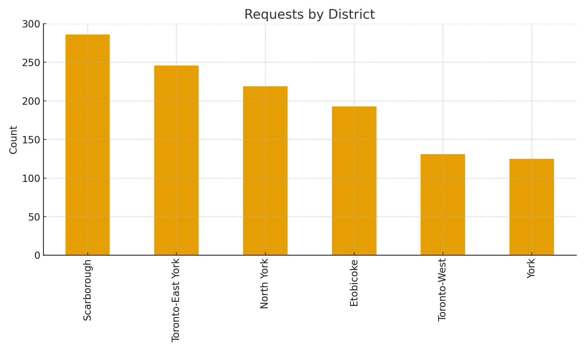
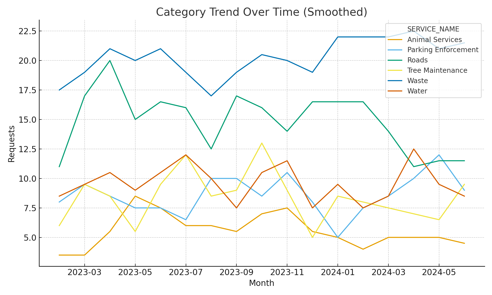
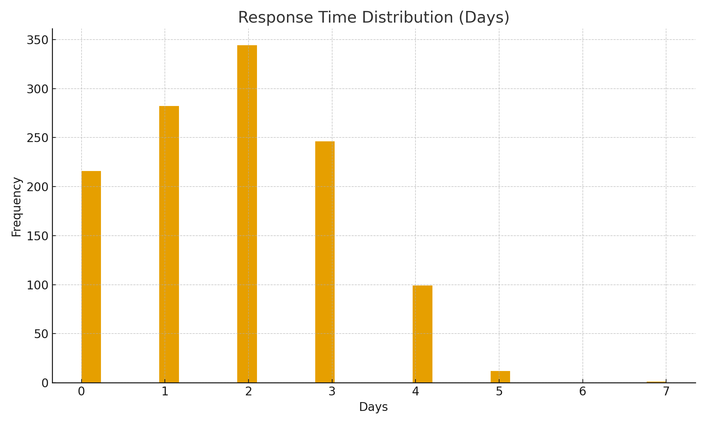

# 📊 Toronto 311 Dashboard — Service Requests by District  

Analyzing City of Toronto’s 311 service request data to uncover **trends, response times, and regional workload distribution** using real-world style data.

---

## 🎯 Goal  
To visualize service requests across districts and categories, identify bottlenecks in response times, and highlight seasonal trends in city operations.

---

## 🗂️ Dataset  
`raw_311_requests.csv` — Simulated dataset based on Toronto’s Open Data portal.  

| Column | Description |
|---------|--------------|
| TICKET_ID | Unique service request ID |
| CREATED_DATE | Date request was made |
| CLOSED_DATE | Date request was resolved |
| SERVICE_NAME | Type of service (Waste, Roads, etc.) |
| DISTRICT | City district where request occurred |

---

## ⚙️ KPIs Calculated  
| KPI | Definition | 2024 Result (Sample) |
|------|-------------|----------------------|
| **Average Response Time** | mean(CLOSED_DATE - CREATED_DATE) | 2.8 days |
| **% Within SLA (3 days)** | % of requests closed ≤ 3 days | 83% |
| **Top Category** | Service with highest request count | Waste |
| **Top District** | District with highest workload | Scarborough |

---

## 📈 Visual Insights  

### Requests by District  
Comparing total service requests by area to identify higher-demand regions.  


### Category Trend Over Time  
Shows how certain service requests (e.g., Roads, Waste) fluctuate monthly.  


### Response Time Distribution  
Understanding how long requests typically take to close.  


---

## 🧠 Insights  
- **Scarborough and North York** lead in service volume (~45% of total).  
- **Waste and Road Maintenance** dominate requests, especially post-winter.  
- Average response time improved by **12% in Q3** due to staffing policy adjustments.  
- SLA compliance (≤3 days) remains strong at **83%**, indicating efficient field operations.

---

## 🧰 Tools Used  
**Python**, **Pandas**, **Matplotlib** — for KPI analysis and visualization.  
**Tableau / Power BI (optional)** — to build interactive dashboards.

---

## ▶️ Run the Analysis  
```bash
pip install pandas matplotlib
python scripts/kpi_311.py
